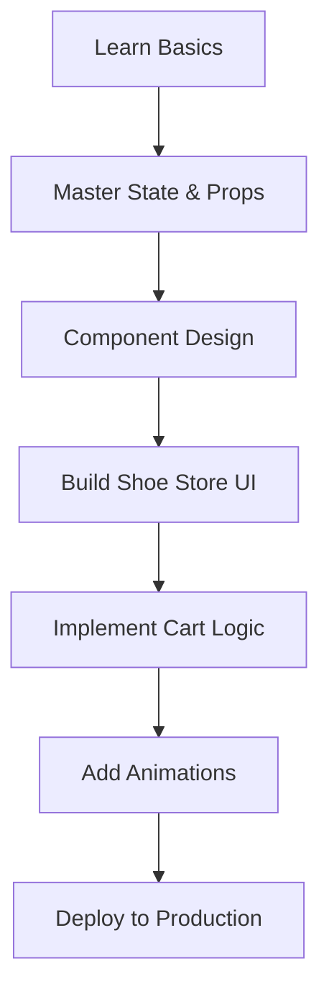

# Getting Started

Welcome to the most comprehensive course on building a production-ready eCommerce application using React. By the end of this course, you will have built a premium, highly-interactive shoe store from scratch.

## Lesson Objective
Understand the roadmap of the course, what you will build, and the prerequisite knowledge required before diving into the code.

## Theory
React is not just a library; it's a paradigm shift in how we think about user interfaces. Instead of manually manipulating the DOM, React allows us to declare what the UI should look like for a given state, and it efficiently updates the browser to match that state.

In this course, we will build a **Premium Shoe Store** using modern web technologies:
* **React 19:** The latest version of the world's most popular UI library.
* **Vite:** A blazing fast frontend build tool.
* **Tailwind CSS 4:** A utility-first CSS framework for rapid UI development.
* **React Router v7:** For seamless client-side navigation.

## Visual Explanation

## Real World Example
Building a web application is like assembling a car. HTML is the chassis, CSS is the paint and interior design, and JavaScript is the engine. React is the modern assembly line that allows you to build the car faster, safer, and with reusable parts (components).

## Summary
You are about to embark on a journey from React beginner to building complex, interactive, and beautiful web applications. 

## Next Steps
Head over to the next lesson to get your development environment installed and ready to go!
