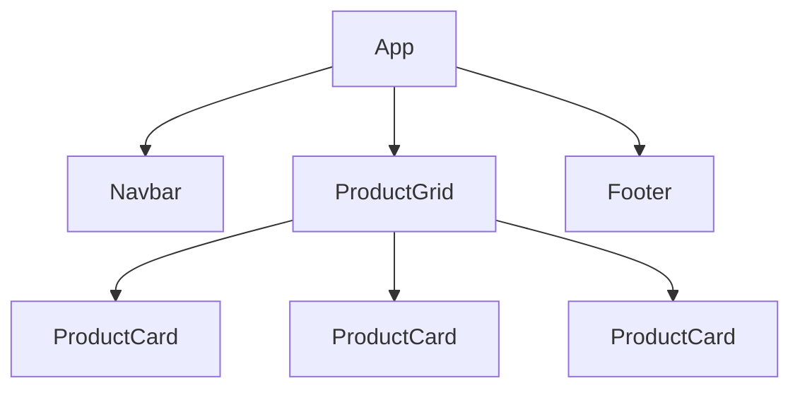

# Components

Components are the fundamental building blocks of any React application. 

## Lesson Objective
Learn how to define, export, import, and compose React components to build a robust UI architecture.

## Theory
Instead of building one massive HTML file, React encourages you to break your UI down into isolated, reusable pieces called **Components**. If you look at a Shoe Store, a single shoe card is a component. You can reuse that exact same shoe card component 50 times on the page just by passing it different data.

## Visual Explanation


## Real World Example
Think of Lego bricks. You have small, simple bricks (Buttons, Inputs) that you combine to build larger, more complex structures (Forms, Cards), which you then combine to build the entire Lego Castle (the App).

## Code
Let's build a reusable button component and use it inside our App.

### 1. Defining the Component
File: `src/components/Button.jsx`
```jsx
import React from 'react';

export default function Button() {
  return (
    <button className="px-6 py-2 bg-black text-white rounded-full hover:bg-gray-800 transition-colors">
      Click Me
    </button>
  );
}
```

### 2. Using the Component
File: `src/App.jsx`
```jsx
import React from 'react';
import Button from './components/Button';

export default function App() {
  return (
    <div className="p-10 flex flex-col items-center">
      <h1 className="text-3xl font-bold mb-6">Welcome to the Shoe Store</h1>
      {/* We can use the Button component multiple times! */}
      <div className="flex gap-4">
        <Button />
        <Button />
      </div>
    </div>
  );
}
```

### Line-by-Line Explanation
1. `import Button from './components/Button';` - We import the component we created in another file.
2. `<Button />` - We render the component using JSX tags. Notice that custom React components **must start with a capital letter**.

## Common Errors
> [!danger]
> **Lowercase Component Names:** If you name your component `button` instead of `Button`, React will think you are trying to render a standard HTML `<button>` tag instead of your custom component. Always use PascalCase for React components!

## Exercise
1. Create a new component called `Header.jsx`.
2. Make it return a `<header>` tag containing an `<h1>` with the text "Shoe Store".
3. Import and render it at the very top of `App.jsx`.

## Summary
Components allow you to split your UI into independent, reusable pieces, keeping your codebase clean and scalable. In the next lesson, we'll learn how to pass data into these components to make them dynamic!
