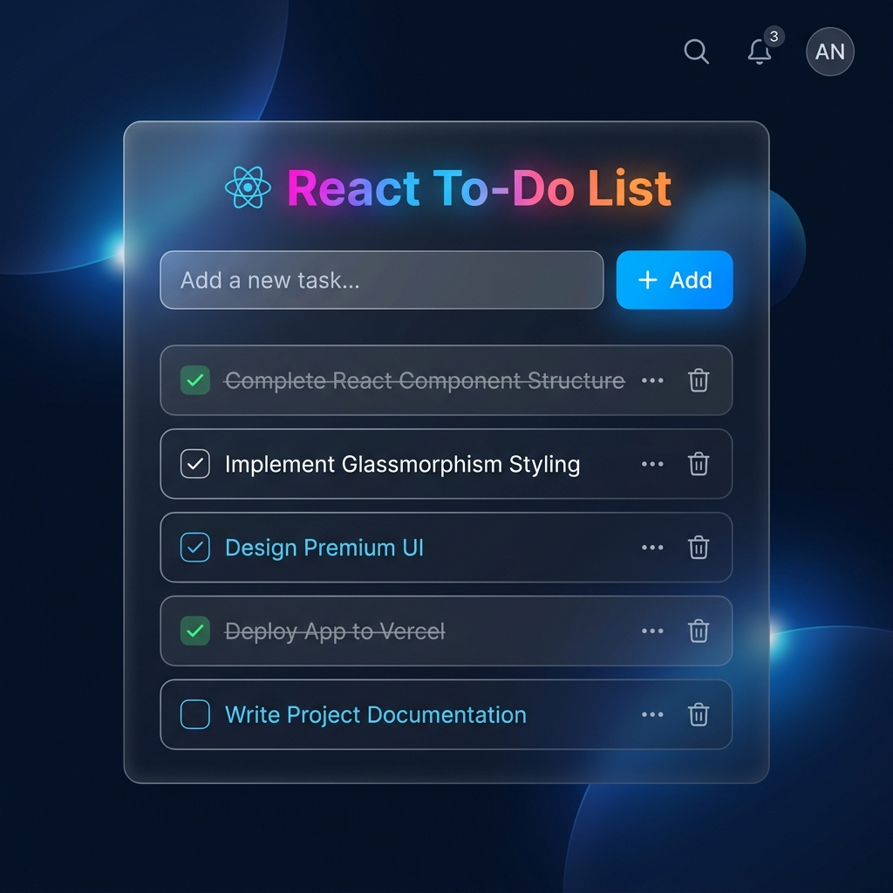

# React To-Do List Tutorial

Welcome to the React To-Do List Tutorial project! This is a beautifully designed, beginner-friendly web application built with React and Vite. It serves as both a fully functional To-Do list and an interactive tutorial for learning React.

[](https://github.com/Astro-Saurav)

---

## 🎨 What You Will Build
Here is a preview of the beautiful, professional-grade To-Do list you will create by following this tutorial:



---

## 🚀 Features

- **Interactive Tutorial**: Step-by-step instructions teaching complete beginners how to build a React app from scratch.
- **Copy-and-Paste Ready**: Full, working code snippets for easy integration.
- **Modern UI**: Features a sleek dark mode with glassmorphism effects, smooth animations, and a premium layout.
- **Fully Functional Demo**: A built-in, working To-Do list that demonstrates the final product.

## 🛠️ Tech Stack

- **React**: The core framework. It lets us build user interfaces using reusable components and memory ("state").
- **Vite**: The build tool. It acts as the engine that runs our local development server incredibly fast.
- **CSS**: Custom styles leveraging Flexbox for layout and Backdrop Filters for the frosted glass design.
- **Lucide React**: A beautiful library for our SVG icons.

---

## 💻 Beginner's Guide: Setup & Running Locally

If you are new to coding, don't worry! Follow these exact steps to get this project running on your own computer.

### Prerequisites
Before you begin, you need a program called **Node.js** installed on your computer. Node.js is what allows us to run Javascript outside of a web browser. You can download and install it for free from [nodejs.org](https://nodejs.org/).

### 1. Download the Project
First, open your terminal (Command Prompt on Windows, or Terminal on Mac). Navigate into the project folder.

```bash
cd do-to-list
```
*Explanation: `cd` stands for "Change Directory". This command simply moves your terminal inside the project folder so it knows where to run the next commands.*

### 2. Install the Required "Packages"
This project relies on external code libraries (like React itself). We need to download them. Run this command:

```bash
npm install
```
*Explanation: `npm` stands for Node Package Manager. When you type `install`, it reads our project's "shopping list" (the `package.json` file) and downloads everything we need from the internet into a new folder called `node_modules`. This might take a minute!*

### 3. Start Your Local Web Server
Now that everything is installed, we can start up the website on our computer!

```bash
npm run dev
```
*Explanation: This tells Vite to build our project and host it on a private, local web server. It will also "watch" our files—so if we change the code and hit Save, the website updates instantly without needing a refresh!*

### 4. View the App!
After running the command above, your terminal will print out a local URL (usually it is `http://localhost:5173`). 

- Open your web browser (Chrome, Safari, Edge, etc.).
- Type `http://localhost:5173` into the address bar and hit Enter.
- **You're all set!** You will see the tutorial website live. 

---

## 📝 Customization

Want to make it your own? Head over to `src/index.css`. We've organized the colors using CSS variables right at the top of the file. You can easily change `--bg-color` or the `--accent-gradient` to create your own unique theme!
